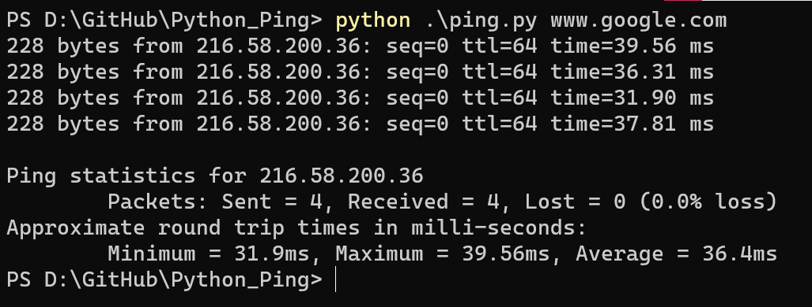

# Simple Python Ping Using Sockets
## Introduction
Ping is a computer network tool used to test whether packets can reach a specific host through the IP protocol. The working principle of ping is to send an ICMP echo request packet to the target host and wait for the echo response packet to be received. The program estimates the lost packet rate and packet round-trip delay time based on the time and the number of successful responses.



## Usage
```python=
python ping.py [OPTIONS] TARGET_HOST
```
> You must be root to send ICMP packets.
### Options
There are 8 options, including `--help`.
```
Options:
    -c INTEGER  Number of echo requests to send. Default is 4.
    -t INTEGER  Timeout in milliseconds to wait for each reply.
    -m INTEGER  Time To Live.
    -i INTEGER  Interval between two requests in seconds. Default is 1.
    -6 BOOLEAN  Use IPv6 protocol instead of IPv4. Default is False.
    -v BOOLEAN  Verbose the info. Default is False.
    -s BOOLEAN  Show the statistics. Default is True.
    --help      Show this message and exit.
```
> The `-6` option can't run on windows, and I haven't test it on Linux.

## Example
### Request Command
```python=
python ping.py www.google.com
```
### Response Message
```cmd=
228 bytes from 216.58.200.36: seq=0 ttl=64 time=39.56 ms
228 bytes from 216.58.200.36: seq=0 ttl=64 time=36.31 ms
228 bytes from 216.58.200.36: seq=0 ttl=64 time=31.90 ms
228 bytes from 216.58.200.36: seq=0 ttl=64 time=37.81 ms

Ping statistics for 216.58.200.36
        Packets: Sent = 4, Received = 4, Lost = 0 (0.0% loss)
Approximate round trip times in milli-seconds:
        Minimum = 31.9ms, Maximum = 39.56ms, Average = 36.4ms
```

### Response Table
| Packet Size |    Dest IP    | Sequence | TTL | Latency  |
|:-----------:|:-------------:|:--------:|:---:|:--------:|
|  228 bytes  | 216.58.200.36 |    0     | 64  | 39.56 ms |

## Requirements
I develop it in `Python 3.8.8 64-bit` on windows and use the library `click` to implement the arguments parsing.

There to ways to install it:
```
$ pip install click

or

$ pip install -r requirements.txt
```

## References
1. [Simple ping implementation in Python using sockets](https://gitlab.com/mezantrop/sp_ping/-/tree/master)
2. [A pure python ping implementation using raw socket.](https://gist.github.com/pklaus/856268)